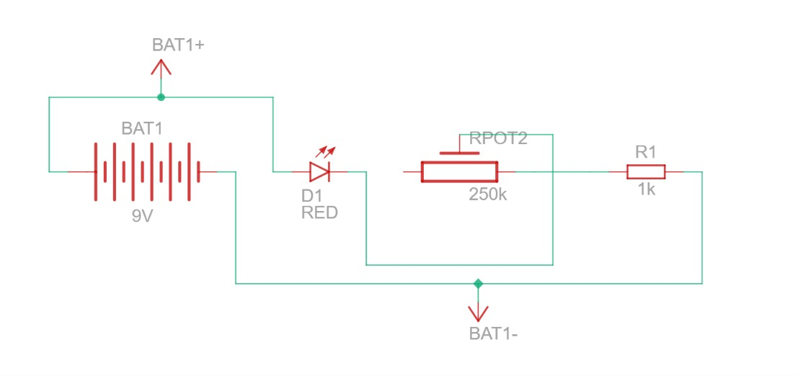
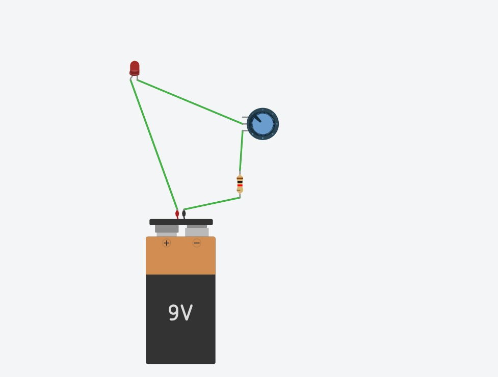
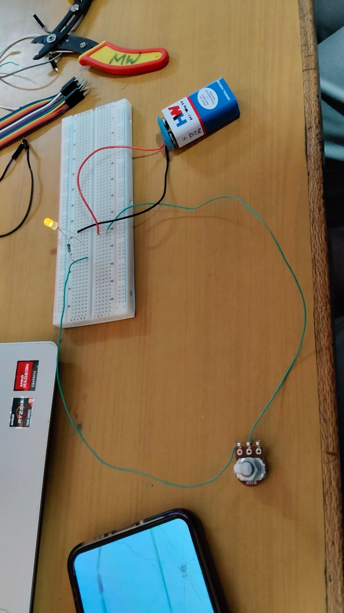

# POTENTIOMETER-CONTROLLED LED BRIGHTNESS CIRCUIT USING A 9 V SUPPLY

1.OBJECTIVE

To build a series LED circuit powered by a 9 V DC battery in which a potentiometer is used as a variable resistor to control the LED current and brightness, and to verify the circuit operation on a solderless breadboard.

2\. COMPONENTS USED

 List of Components Used

| s.no | Component | Quantity | Value/Rating | Purpose |
| :---: | :---: | :---: | :---: | :---: |
| 1 | DC Battery | 1 | 9V |  Provides the DC power supply |
| 2 | LED | 1 | Red LED; Vf ≈ 2 V | assumed for calculation| Produces visible light |
| 3 | Potentiometer | 1 | B10K, 10 kΩ linear |  Acts as a variable series resistor |
| 4 |  Resistor R1 | 1 | 1 kΩ | Limits the maximum LED current |
| 5 | Solderless Breadboard | 1 | Full-size | Provides solderless circuit assembly |
| 6 | Jumper Wires | As required | Single-core | Provides electrical interconnections  |

## 3\. CIRCUIT SETUP AND CONNECTIONS

3.1 Breadboard Circuit

The circuit was assembled on a solderless breadboard. The LED and 1 kΩ resistor were mounted on the breadboard, while the B10K potentiometer was connected using jumper wires. A 9 V battery was used as the DC power source.

The LED was observed to glow when the circuit was powered.

                          Breadboard circuit setup with potentiometer and 9 V battery

3.2 Circuit Connections

| S.No | From (Component / Pin) |  To (Component / Pin) | Purpose |
| :---: | :---: | :---: | :---: |
| 1 | Battery positive (BAT1+) |  LED D1 anode |  Supplies positive voltage to the LED |
| 2 | LED D1 cathode | Potentiometer wiper terminal |  Connects the LED to the variable resistance |
| 3 | Potentiometer one end terminal | Resistor R1 | Places the resistor and potentiometer in series |
| 4 | Resistor R1 | Battery negative (BAT1−) | Completes the return path  |
| 5 |  Potentiometer other end terminal | Not connected | Allows the potentiometer to operate as a two-terminal variable resistor |

The LED, potentiometer and R1 therefore form a single series current path.

5\. SIMULATION

The circuit was simulated using Tinkercad Circuits to verify the circuit arrangement and current path.

For consistency with the physical hardware, the potentiometer used for the final circuit documentation is 10 kΩ (B10K).  

                      Tinkercad simulation of the potentiometer-controlled LED circuit

6\. CIRCUIT SCHEMATIC

The schematic consists of a 9 V battery, LED D1, B10K potentiometer RPOT2 and 1 kΩ resistor R1 connected in series.

                                   Circuit schematic of the potentiometer-controlled LED brightness circuit

6\. FUNCTION OF COMPONENTS

9 V Battery:  
Provides the DC voltage required to drive current through the circuit.

LED (D1):  
Emits visible light when forward biased. For calculation purposes, a typical forward voltage of approximately 2 V is assumed.

Potentiometer (RPOT2):  
The potentiometer is used as a two-terminal variable resistor. Rotating its shaft changes the resistance in series with the LED, thereby changing the LED current.

Resistor R1 (1 kΩ):  
Provides a minimum series resistance and limits the maximum current through the LED when the potentiometer is at its minimum resistance.

Solderless Breadboard:  
Provides a convenient method for assembling and testing the circuit without soldering.

Jumper Wires:  
Provide electrical connections between the battery, LED, potentiometer, resistor and breadboard.

7\. WORKING PRINCIPLE

7.1 Theory

The LED, potentiometer and R1 are connected in series. Therefore, the same current flows through all three components.

Using Kirchhoff's voltage law, the approximate LED current can be calculated as:

I \= (Vs − Vf) / (R1 \+ Rpot)

Where:

\- Vs \= 9 V  
\- Vf ≈ 2 V is assumed for the red LED  
\- R1 \= 1 kΩ  
\- Rpot \= potentiometer resistance

For the B10K potentiometer used in the hardware:

Potentiometer Setting| Approx. Rpot| Total Resistance| Approx. LED Current  
Minimum| 0 Ω| 1 kΩ| 7 mA  
Maximum| 10 kΩ| 11 kΩ| 0.64 mA

These values are calculated estimates, not measured values.

At minimum potentiometer resistance, R1 provides the main current limitation. At higher potentiometer resistance, the total circuit resistance increases and the LED current decreases.

7.2 Step-by-Step Operation

1\. The 9 V battery supplies voltage to the circuit.  
2\. The LED is forward biased and allows current to flow through the series path.  
3\. R1 provides a minimum resistance to limit the maximum LED current.  
4\. The potentiometer adds variable resistance to the circuit.  
5\. Increasing the potentiometer resistance reduces the current through the LED.  
6\. Decreasing the potentiometer resistance increases the LED current.  
7\. Therefore, changing the potentiometer setting can be used to control the LED brightness  
8\. OUTPUT AND OBSERVATIONS

 Circuit Observation

| Condition | Observation |
| ----- | ----- |
| Circuit powered with 9 V battery | LED glowed |
| Potentiometer used in series | Provides variable resistance |
| R1 included in series | Provides current limiting |
| Potentiometer resistance increased | LED current is expected to decrease |
| Potentiometer resistance decreased | LED current is expected to increase |

The hardware circuit successfully produced light from the LED when powered by the 9 V battery.

No multimeter measurements were recorded, so the current values presented in Section 8 are calculated estimates rather than experimental measurements.

### 9\. APPLICATIONS\*

* ###  Adjustable-brightness indicator lamps and panel lights

* ###  Dimming of small LED lighting, such as night lights or display backlights

* ###  Simple brightness-control circuits in hobby and prototype projects

* ###  Classroom demonstrations of variable resistance and current control

### 10\. LEARNING OUTCOMES\*

###       Through this activity, the following were demonstrated:

* ### Constructed a series LED circuit on a breadboard using correct LED  polarity                           

  * ### Applied the relation I \= (Vs − Vf) / (R1 \+ Rpot) to predict LED current

  * ###  Explained how a potentiometer used as a variable resistor changes current and LED brightness

  * ### Explained why the fixed resistor R1 is needed to prevent excess current at the minimum setting

  * ### Compared simulation and hardware results and identified differences between them

### 12\. CONCLUSION

### The potentiometer-controlled LED circuit was built on a breadboard and checked against its schematic and simulation. The potentiometer acts as a variable series resistance that sets the LED current, and the fixed resistor R1 limits that current to a safe value at the minimum setting. The LED glowed on the hardware, which is consistent with the calculated current range of about 0.64 mA to 7 mA for a 10 kΩ potentiometer. The activity demonstrated how resistance controls current and brightness in a series LED circuit.

### 
